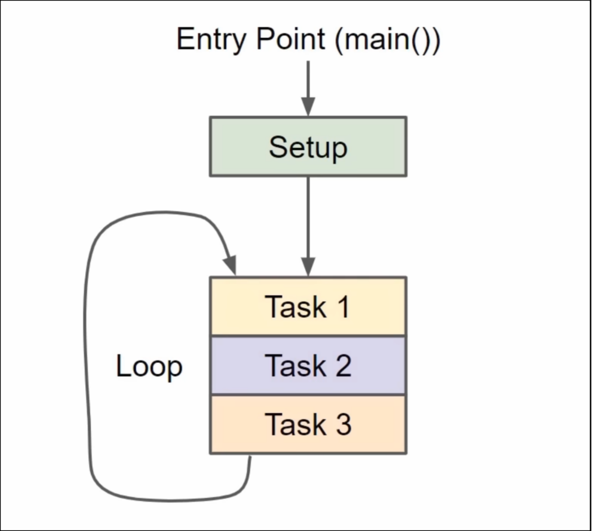
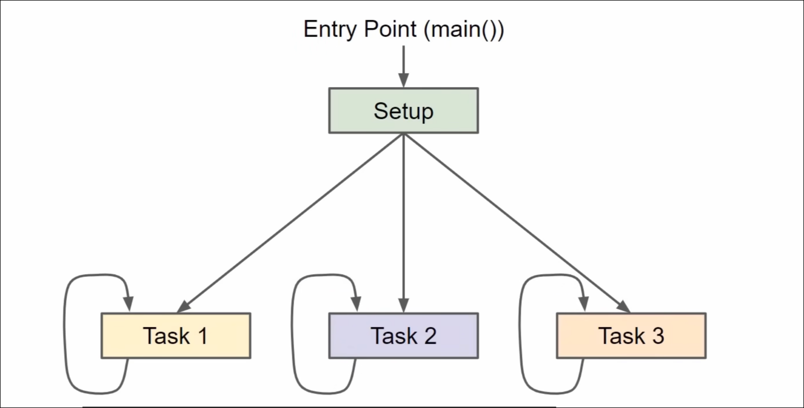

# Introduction 

1. OS = Operating System
2. RTOS = Real-Time OS 

## RTOS 

Definition: An RTOS is an operating system designed for real-time applications, ensuring predictable and low-latency responses to meet strict timing constraints, often used in embedded systems.

Pros:

- Predictable and fast response times for critical tasks.
- Efficient resource usage with a small memory footprint.
- High reliability for mission-critical applications (e.g., aerospace, medical).
- Optimized for low-power devices.
- Deterministic task scheduling ensures deadlines are met.

Cons:

- Limited scalability for complex or general-purpose applications.
- Higher development complexity due to precise timing requirements.
- Minimal support for dynamic memory allocation or virtual memory.
- Fewer built-in features compared to general-purpose systems.
- Often requires specialized expertise for implementation.

<!--end_slide-->

## General Purpose OS 

Definition: A GPOS is an operating system designed for a wide range of computing tasks, prioritizing flexibility, user experience, and throughput over strict timing, used in devices like PCs, servers, and smartphones.

Pros:

- Highly versatile, supporting diverse applications and hardware.
- User-friendly with rich graphical interfaces and extensive features.
- Scalable for various workloads, from personal devices to servers.
- Supports dynamic memory management and multitasking.
- Large developer community and abundant software support.

Cons:

- Non-deterministic response times, unsuitable for real-time tasks.
- Higher latency and less predictable performance.
- Larger memory and resource footprint.
- Higher power consumption, less suited for embedded systems.
- Lower reliability for critical applications due to complex design.

<!--end_slide-->

# Super Loop 

<!--end_slide-->

# RTOS 

<!--end_slide-->

# Some Terminologies 

## Task 

Any piece of work we need done in a piece of code. 

OR 

Set of program instructions loaded in memory 

## Thread 

A unit of CPU utilization with it's own program memory and stack. 

## Process 

Instance of a computer program.

---

In FreeRTOS, task = thread. 

